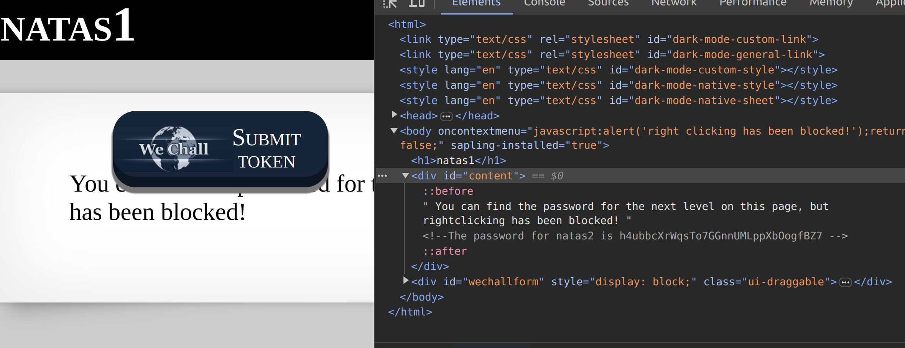

For this level, the only change is that the webpage does not allow right-clicking. For finding the password, we use the same method where we go into chrome's developer and inspect the HTML. The password is again inside the div tag: `content`.

