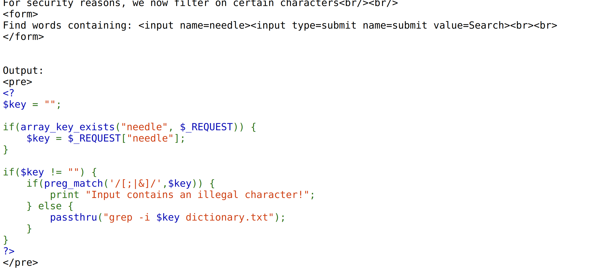
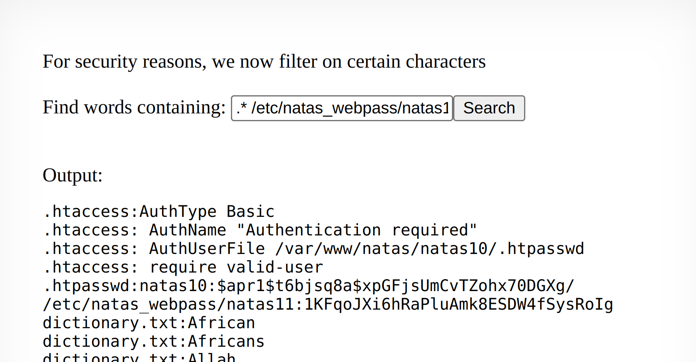

Pretty much same as lvl9 as it uses grep in the source code except it sanitises key chars like ";" to stop command injection. 

To counter this, we should utilise grep's characteristic of being able to provide a pattern than files and inject into the form:
`.* /etc/natas_webpass/natas11`.

the .* highlights all the contents inside the /etc/natas_webpass/natas11.

