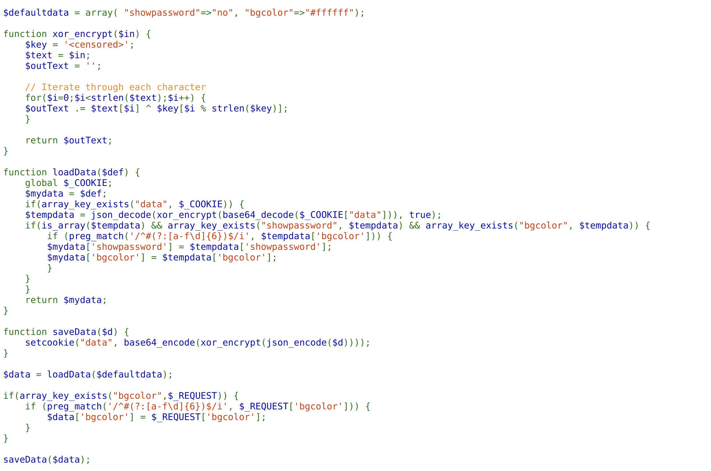
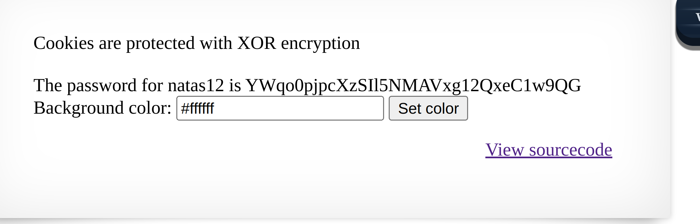

For this level, the source code delves deep into XOR encryption. The xor_encrypt function in the code demonstrates how each character of the input is XOR'ed with a hidden key. 



Once encrypted, the data is stored in the cookie using a combination of base64 encoding and the aforementioned XOR encryption.s
`$tempdata = json_decode(xor_encrypt(base64_decode($_COOKIE["data"])), true);
`
Here, the cookie data undergoes a base64 decode, followed by an XOR decryption, and is then finally transformed into a PHP associative array.

Conversely, the SaveData function essentially performs the reverse:
`setcookie("data", base64_encode(xor_encrypt(json_encode($d))));
`
To break the code, we aim to determine the XOR key that, when used, sets the "showpassword" value to "yes" in the cookie. The XOR encryption's beauty is its symmetry: the same operation can both encrypt and decrypt. By knowing the plaintext and the cipher, we can derive the key:

`plaintext XOR cipher = key`

To get our hands on the plaintext, we consider:

`$defaultdata = array("showpassword"=>"no", "bgcolor"=>"#ffffff");
`

And the cipher is the value stored in the Application->Cookie.


(Note: "%3D" is URL encoding for the "=" sign, which should be omitted here.)

Applying the XOR operation between the known plaintext (after json encoding) and the cipher (after base64 decoding) reveals the repeating XOR key.

Once we've determined the key, we can use the SaveData function's logic to craft our malicious cookie with "showpassword" set to "yes":

```
$data = array("showpassword" => "yes", "bgcolor" => "#ffffff");
$key = "KNHL";  // the derived key from the XOR operation
$spoofed_cookie = encrypt($data, $key);
```

This crafted cookie value, when set in the application, should 
expose the password.



In reflection, this challenge is a real brain-teaser. XOR encryption, while straightforward conceptually, can be tricky to handle in practical scenarios. Decrypting without directly knowing the key demands not just persistence but also a bit of luck.