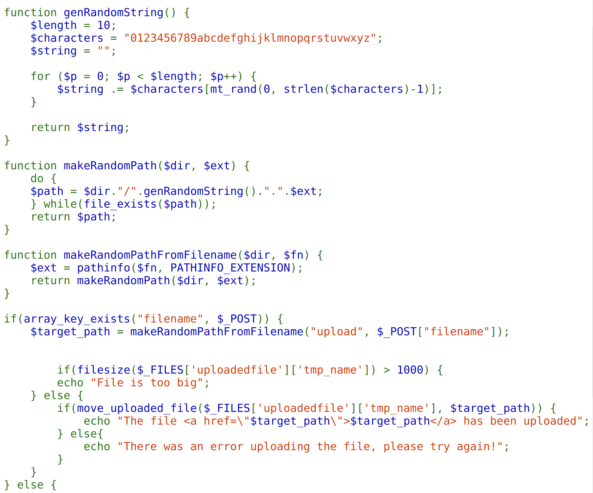
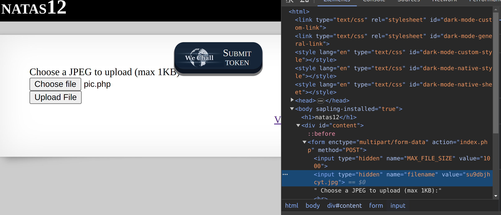
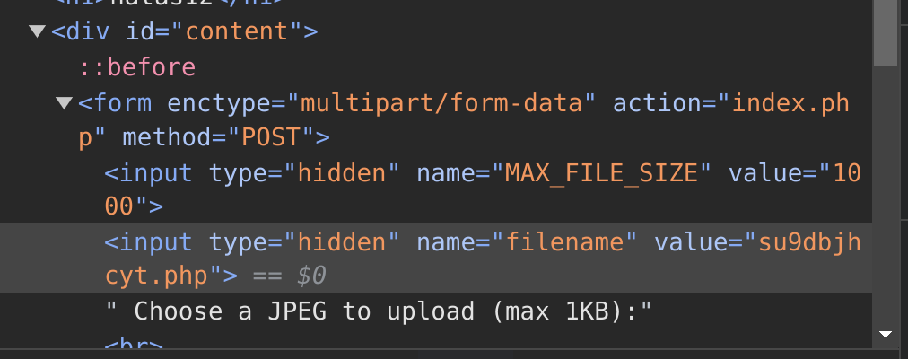
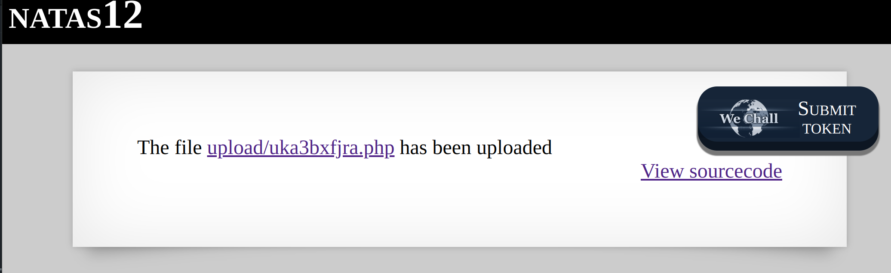
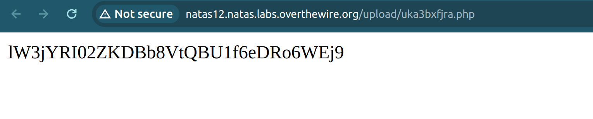

This level required you to upload a file which is executable. From the source code provided, the code generates a new generated path for the file you uploaded. However, there are no checks for the file type which we can utilise to upload our scripts. 


The only security measure was a line of code that just changed the file extension to .jpg. So, I uploaded a php file with the contents:
```
<?php
echo exec("cat /etc/natas_webpass/natas13");
?>
```

Before pressing upload, I edited the file extension in chrome developer mode to php and it worked! I opened the file and got the password from there.







