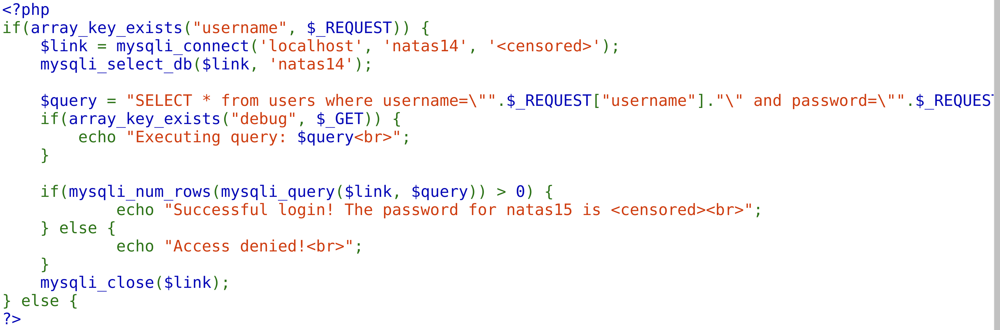
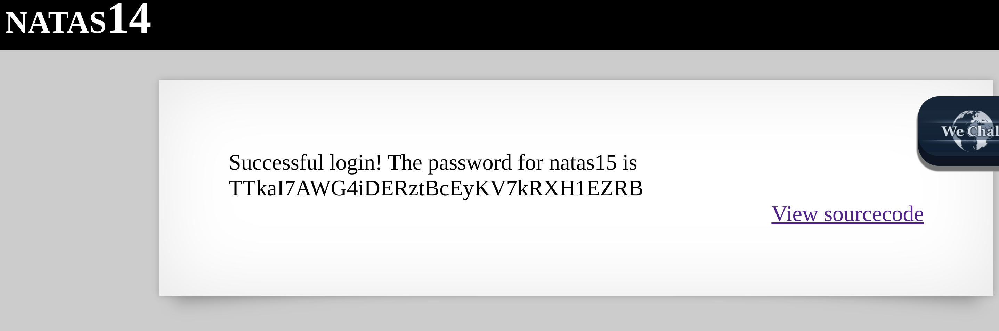

For this level, the source code shows that we are dealing with a SQL injection challenge. 


The challenge is really simple as it just requires a simple injection like so:
```
yes" or 1 = 1 #test
```
The `yes"` section ensures that the original quotation mark is ended for us to inject our own queries
The `or 1 = 1` ensures that everything is TRUE so that we can get all the fields
The `#test` ensures that the query after our code is commented out and not executing




Since it is so easy to inject SQL statements inside queries, how do you actually protect your websites against them? 
Following the [OWASP cheat sheet series](https://cheatsheetseries.owasp.org/cheatsheets/SQL_Injection_Prevention_Cheat_Sheet.html), we should:
Firstly, only be using prepared statements instead of directly user input into the SQL with the usage of parametrized queries. 

Original statement:
```
$query = "SELECT * from users where username=\"".$_REQUEST["username"]."\" and password=\"".$_REQUEST["password"]."\"";
```

changed to:
```
$our_stmt = mysqli_prepare($link, "SELECT * from users where username=? and password=?");

// binding the input values to ensure no string injection
$mysqli_stmt_bind_param($our_stmt, "ss", $_REQUEST["username"], $_REQUEST["password"]);

// Execute our query
mysqli_query_execute($our_stmt);

... //rest of the code
```