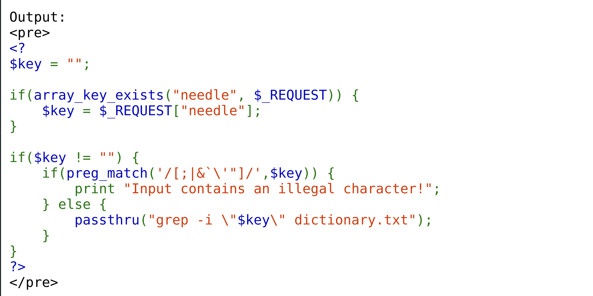

When it comes to this level's challenge, it's clear we are dealing with grepping again. The source code does not give us many vulnerabilities except for the `$key` variable in the grep command which sanitises any linux commands like:
```
/[;|&`\'"]/
```


The challenge demands a unique approach, especially given the filters and constraints we're working within. I attempted to combine the path from a previous grepping challenge /etc/natas_webpass/natas17 with a strategy from the previous level.

The approach involved iterating through potential password chars using the grep command:
```
$(grep -E ^<password + char>.* /etc/natas_webpass/natas17)Africans
```
where:
    - The $(...) syntax spawns a subshell, which allows us to execute nested commands.
    - The Africans string at the start acts as a filter to check if the returned result is NULL, and if so, add the char to the password string.

An image of a certain iteration without the correct password input.


By iterating through all the chars, you can get the password. You can also refer to the source code provided for the demonstration of the attack.


### Protecting against command injections
Like normal SQL injections, these attacks only threaten us if we do not know of them or take proactive steps to defend ourselves against them.
Like what Sun Tzu said, any attack tactic that is repeated twice on the battlefield, does not have the same effect as the first time.

Similarly, there is also a way to protect ourselves from command injections: 
1. Always sanitise and validate inputs to make sure they are not trying to inject anything into your system. For example:
    - quote the data tp enforce that it's the data to be intepreted
    - Removing meta-characters like %27 which are escape sequences that expand to a single quote
2. Try to containerise your system and only set up the least privileged access to users.

You can also refer to the source code for a demonstration on how the attack works.
