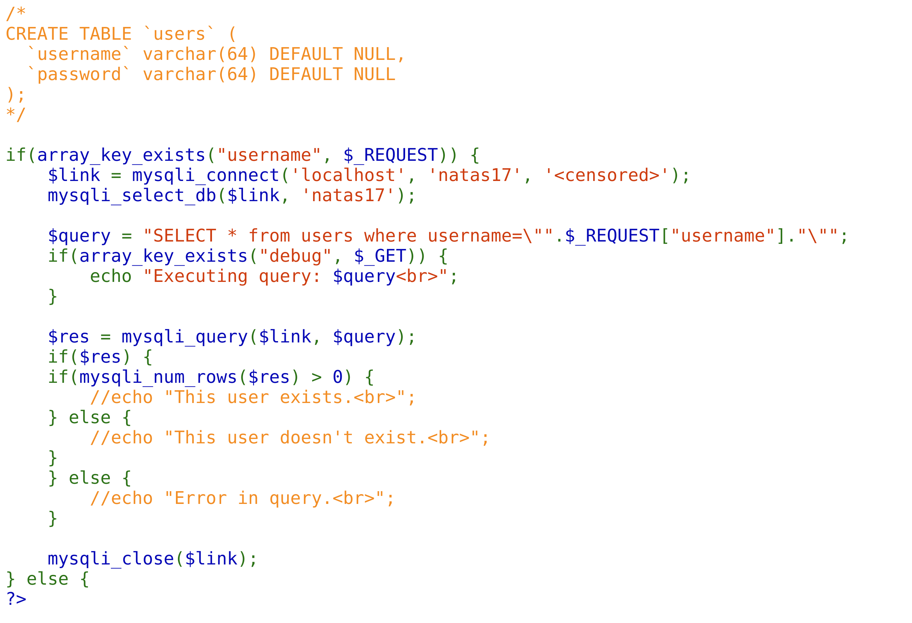

In this level, the source code points out that we are solving another SQL injection challenge. The tricky part here, however, is that the SQL queries can only give a binary value of true or false on if the user exists or not. So, we cannot ordinarily return a truthful value returns only blank space, e.g., `natas17" or 1=1 #test`. 

Upon researching, it becomes apparent that this challenge aligns with a type of SQL injection known as "time-based blind SQL injection". 




## What is Time-Based Blind SQL Injection?

Time-based blind SQL injection is an inferential SQL injection technique where the attacker is able to make conclusions about the structure of the database by sending payloads that force the database to wait (or "sleep") for a specified amount of time before responding. A delay in the response will indicate the query condition is TRUE, and no delay indicates the condition is FALSE.

Further reading can be found here in A link to how the attack works out is found in [OWASP](https://owasp.org/www-community/attacks/Blind_SQL_Injection#:~:text=Time%2Dbased,indicating%20successful%20SQL%20query%20executing.) website.

The idea here is quite simple: use the SQL `SLEEP()` function to introduce a deliberate delay in the SQL query. If the delay is observed, it confirms the truthfulness of the condition being tested.

For this level, the approach is to use the `SLEEP()` function to deduce each character in the password. Here's the general template:

```
natas17" AND IF(SUBSTRING(password,1,1)='a', SLEEP(5), 1) #test
```

Based on this procedure, we can now cycle through each possible character in the charset until the entire password is deduced.
