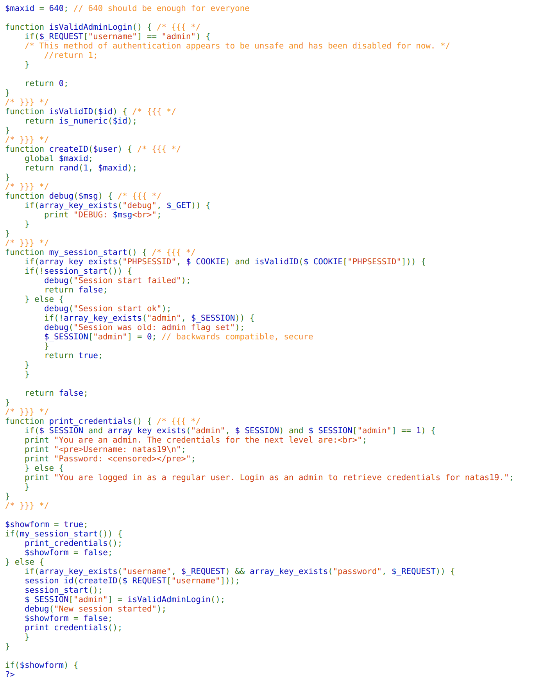

For this level, you need to know a bit about php.
In PHP applications, you might come across the `PHPSESSID`. This ID is integral to how PHP manages sessions. When you face a situation where the `PHPSESSID` holds potential clues about the application's behavior, it might be a good idea to brute-force it to uncover certain seeds.

## PHPSESSID: A Brief Overview

For those unfamiliar with PHP, here's a quick introduction to PHPSESSID:

When a user visits a PHP site for the first time:
1. A request is made to the web server, which is then passed to PHP.
2. `session_start()` checks for a session ID. If it's the user's first visit, none exists, so a new one is generated.
3. PHP sends out the response (typically HTML) and instructs the browser to save a cookie containing the newly minted session ID.
4. On subsequent visits, the browser includes the session ID in its requests, allowing PHP to identify the session.

PHP often uses session files stored on the server to manage variables within a session. For instance, `$_SESSION['logged_in']` can indicate if a user is logged in.

The code given is derived from the above definition and based on some extra conditions, we can outline our goal:
- Brute-force PHPSESSIDs ranging from 1-640.
- Identify the PHPSESSID which gives us `$_SESSION["admin"]` to be  1.

A way to do this by code is through iterating through all PHPSESSIDs and if the response given contains "You are an admin", it means we got our PHPSESSID that gives us the password.

### Improved methodology:
A way to fasten up the script is by concurrently executing through all PHPSESSIDs. This can be done by splitting the tasks into different threads. For example, thread 1 works on PHPSESSIDs ranging from 1-80, thread 2 works on PHPSESSIDs ranging from 81-160 and so on.