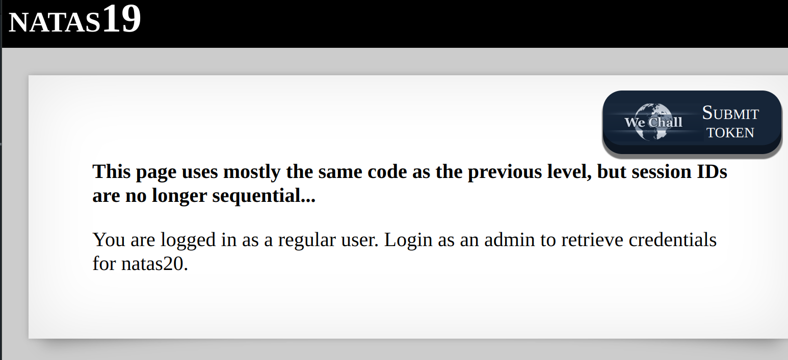
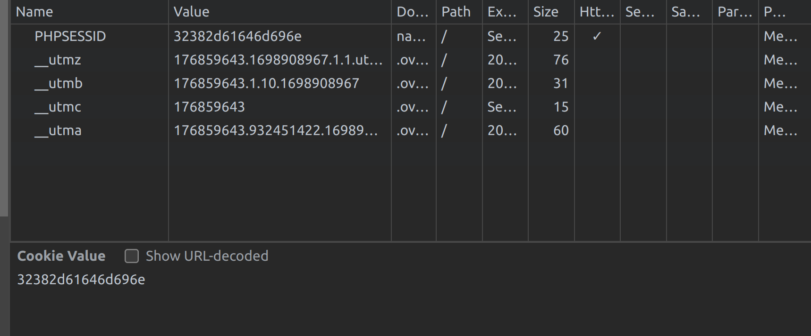
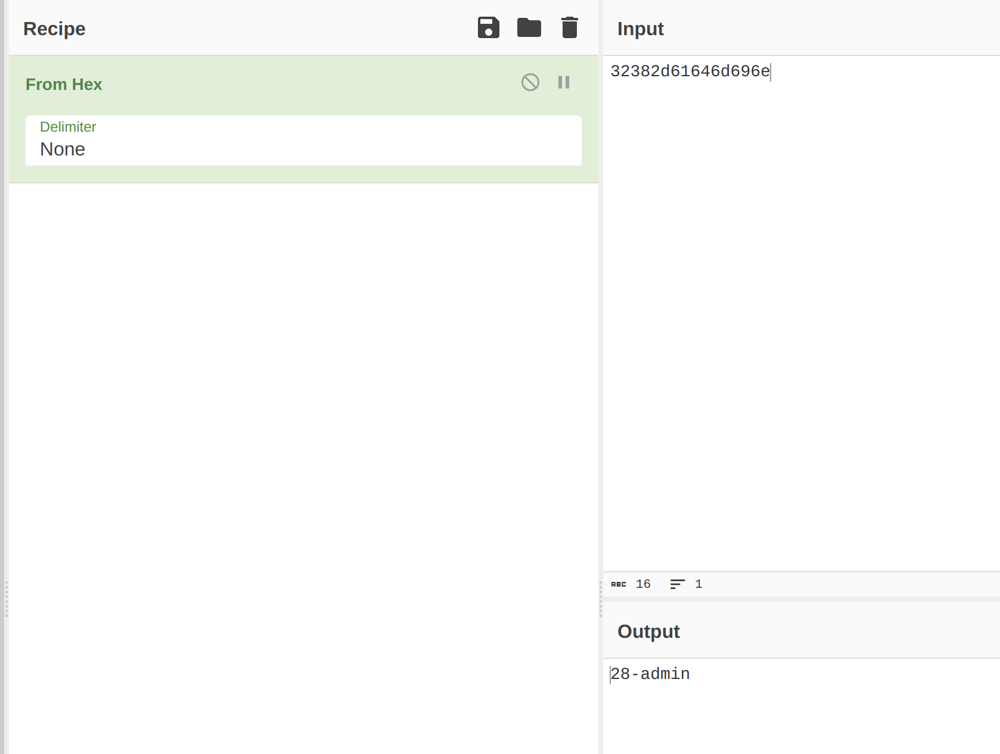

This level is a variation of the previous, but with a subtle twist. 
While the code is not provided, some immediate observations can be made:
    - The session IDs aren't sequential this time
    - The session IDs are encoded (most likely in hex)

When you enter empty fields for both username and password, you'll receive a message:

The PHPSESSID looks to be encoded this time which is shown true in cyberchef

Now we know how the PHPSESSID is encoded and what its decoded value looks like we can do the same trick from last exercise to get the password. The only variation is that we need to encode the number with a dash and admin string behind.
The source code is provided for demonstration.
