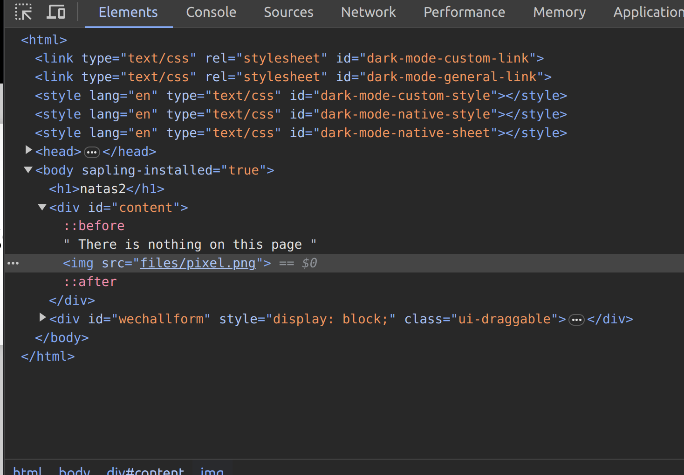
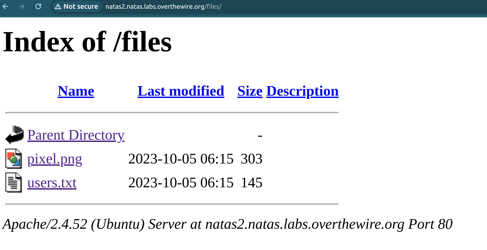

For this level, the key lies in URL manipulation. To uncover the password, dive into chrome's developer mode, where you'll spot an image source pointing to files/pixel.png.

Following this lead, delve into the files route. Here, you'll find a file named 'users.txt'. This contains the password for progressing to the next stage.

