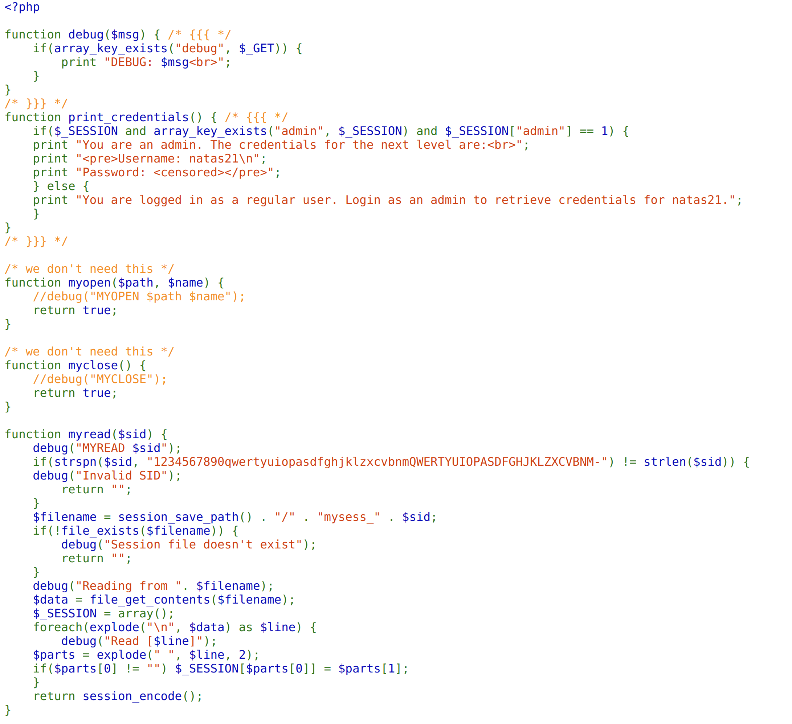
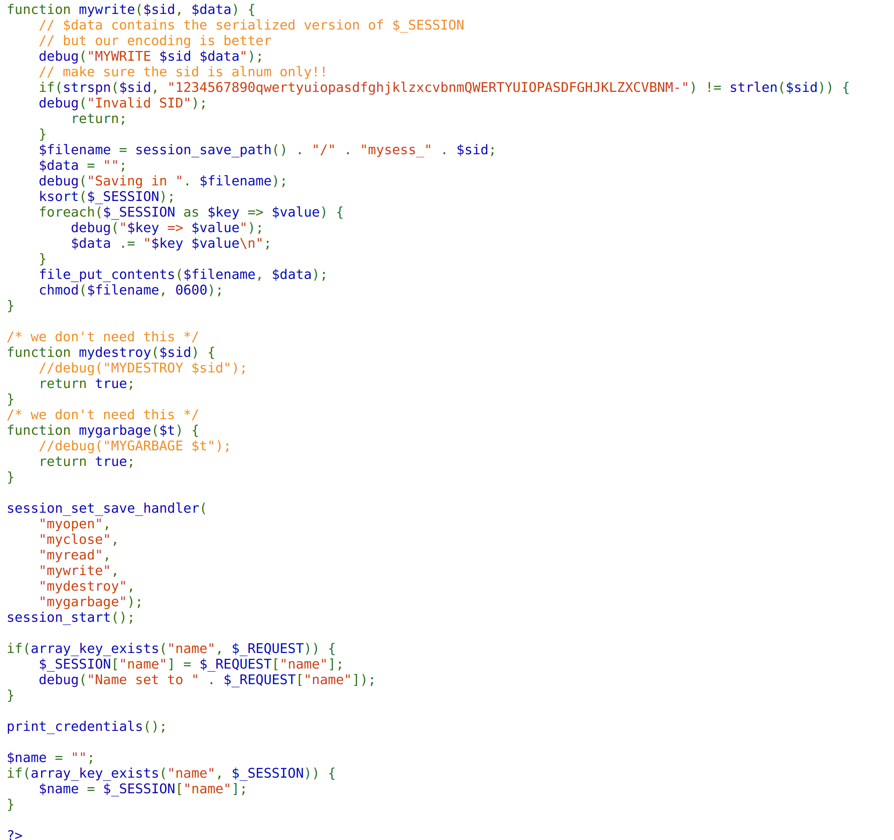
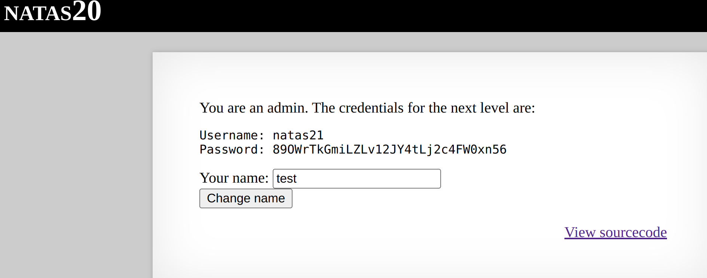

On inspecting the source code, we notice the custom functions, myread() and mywrite(), to manage session data. Instead of PHP's built-in session handling, the challenge uses these custom functions.




### For the mywrite() function:
It processes session data by iterating over each key-value pair in $_SESSION. For each session variable, it appends the key and value as “<sid> <data>” followed by a newline which we can possibly exploit.

Hence, the target is to inject our own key and value in the newline provided in `mywrite()` function.  If the name was something like `test \n admin 1`, the newline character would be written to the session file. Then in the `myread()` function, the "admin 1" would be interpreted as a separate session variable.
Finally, in the `print_credentials()`, the admin value is processed as follows:

```
if($_SESSION and array_key_exists("admin", $_SESSION) and $_SESSION["admin"] == 1) {...}
```
which should give us admin permission.

In code, the only thing we are doing is injecting a random variable name followed by the newline injecting in `admin 1` to get the right PHPSESSID and password.


