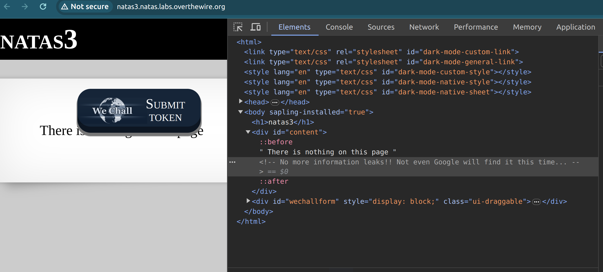
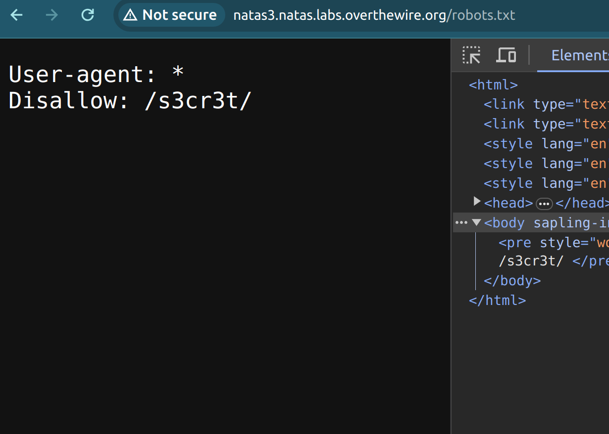
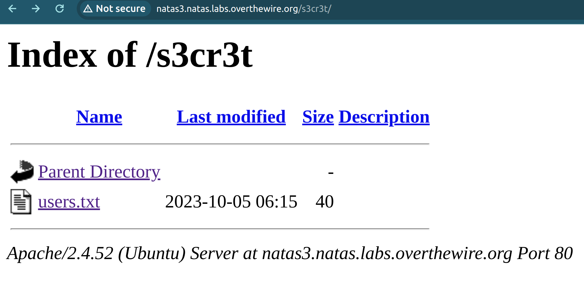

In this level, a foundational understanding of web architecture and front-end development is essential. 

We start by delving into the HTML:

The subtle hint nudges us towards the robots.txt file. What's the significance? When developing front-ends, there is normally a robots.txt file that help guide or block search engines, like Google, from indexing specific sections of a site. 

Going into the robots.txt route, we find the code disallows `Disallow: /s3cr3t/` folder which hides a `users.txt` file with the password to the next level.

### Reflection: 
This was one of the more abstract exercises for me as I had made web-crawling spiders before but my limited frontend experience had me go on a tangent to finding the password through the "noindex" tag to hide from Google while leaving it public to visitors. The realisation moment that it was to find the robots.txt instead of the "noindex" tag was when browsing through this website [Here]([[https://link-url-here.org](https://developers.google.com/search/docs/crawling-indexing/block-indexing)https://developers.google.com/search/docs/crawling-indexing/block-indexing]).
