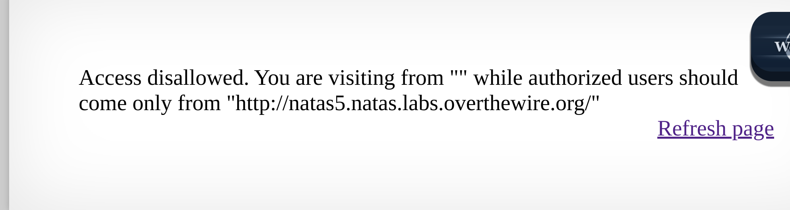
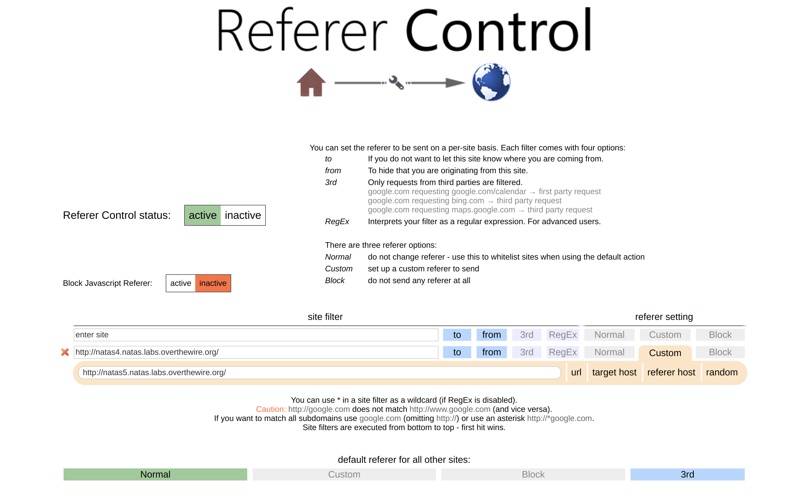
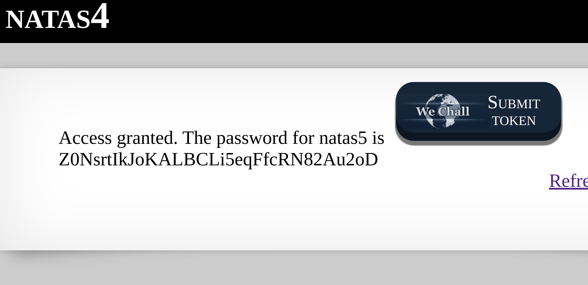

This level is quite tricky. First, the hint given is quite abstract where it says: 

From the hint, we need to find a way to access the website from natas5 where we have no authorisation access. So, how do we do that?

Well, there is a concept of a referer (without the r).
Referers serve as headers, pinpointing the original URL or webpage from which a request emerged.

For clarity, here's a Chrome definition: The referer-policy header specifies the data available in the Referer header, relevant for navigation and iframes within the destination's document.

By default, "strict-origin-when-cross-origin" ensures only the origin transmits in the referer header during cross-origin requests.

Now we know about referers and can solve the problem. For me, I solved it using a referer control chrome extension to refer me from natas5 website to natas4 website which worked.

### Reflection:
For this level, I did not know the term "referers". The initial way I attempted to solve this challenge was through using proxy servers to fake a link through headers and appear to come from natas5. However, later on I realised that we could just try intercept the http request data and there referers came to the scene. Pretty much all these exercises help me broaden my eyesight of ways to solve the same question that can be applied not just in security.

