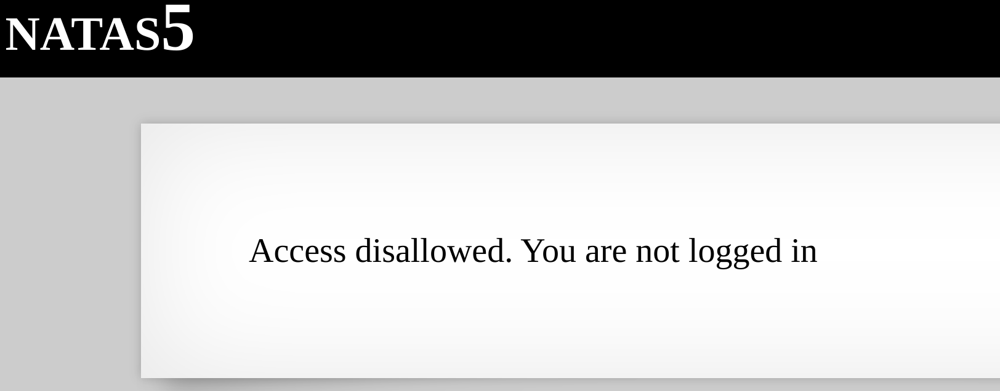
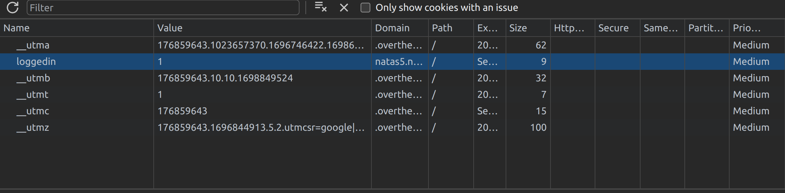
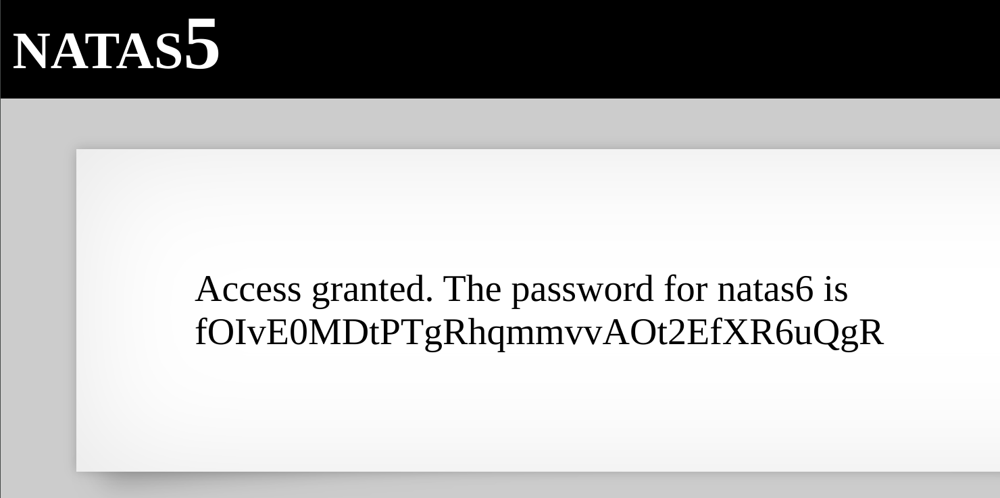

For this level, the hint was quite a giveaway.

From the hint, we know that we are not "logged in". Now, when it comes to web authentication, passwords or session states are often stashed away as tokens or within cookies. Luckily, the logged in status is stored in as a cookie and we just need to alter the value to get the password.

