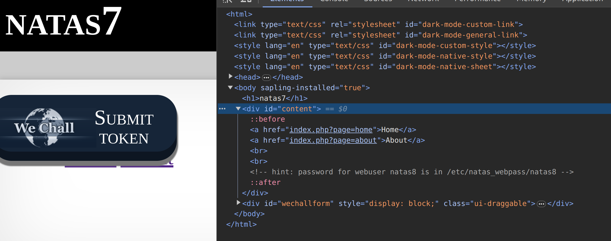
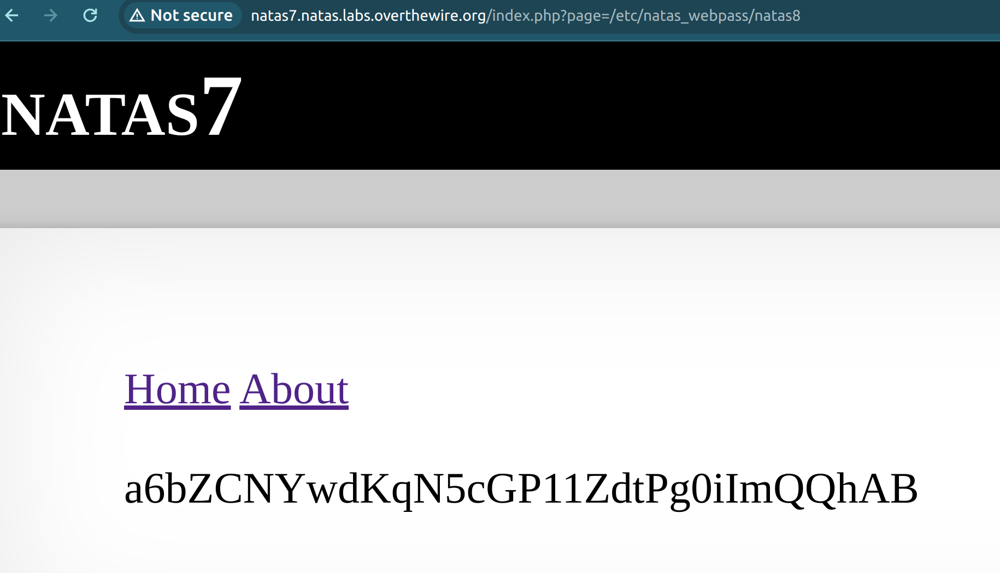

This level introduces us to a new concept of "Local File Inclusion (LFI)" which is a type of URL manipulation vulnerabilities.

Using chrome's developer mode, the HTML provides us with a hint pointing to a folder called: `/etc/natas_webpass/natas8`. 

However, a straightforward attempt to navigate using this route ends in a familiar 'page not found' (404) error. This error arises because we're bypassing the expected query parameter. 
To crack this, we need to traverse the route which leads us to a password like this:
`http://natas7.natas.labs.overthewire.org/index.php?page=/etc/natas_webpass/natas8`

### Reflection:
For this challenge, what helped me understand what to do was the URL which was kind of a giveaway. Whenever I switch pages, the URL "page" section will change which I have utilised to directly get the password file. However, what prompted me to write this reflection was to solve these challenges, you not only required some domain knowledge of networks, but also a rough idea of what attacks are on the network side which I was lacking. To counter this, I used portwigger, another learning platform which systematically taught me about concepts like URL manipulation and some binary exploitation methods which I used in other challenges.
