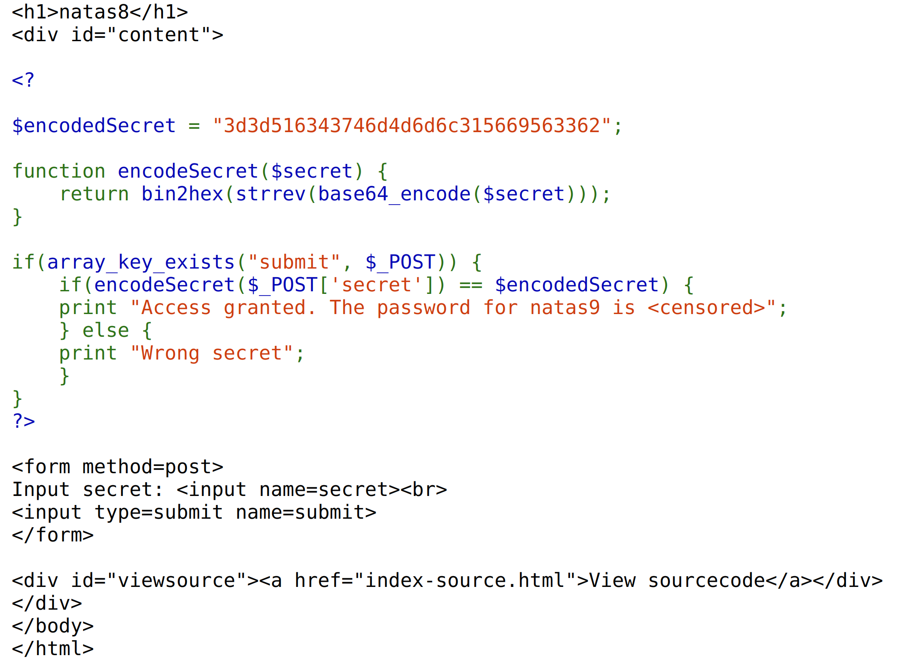
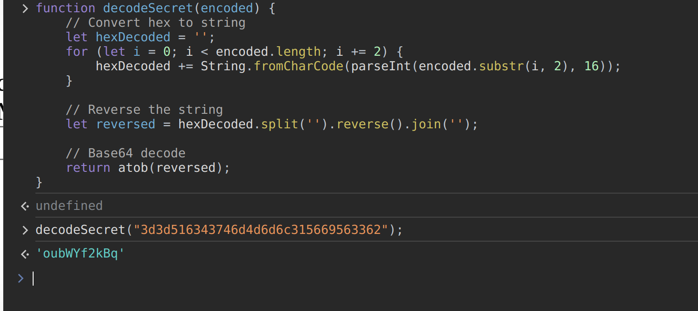
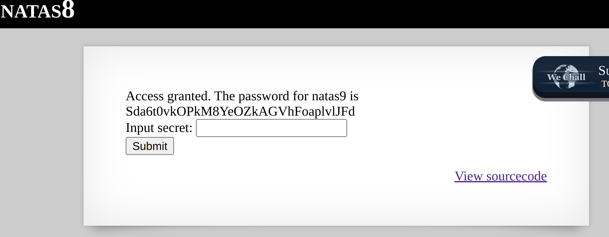

For this level, the source code provided does not directly give us an encoded secret this time. So, all we have to do is decode the secret.

For me, I wrote a quick script on the js console that decoded the secret for the form and gave me the password.

